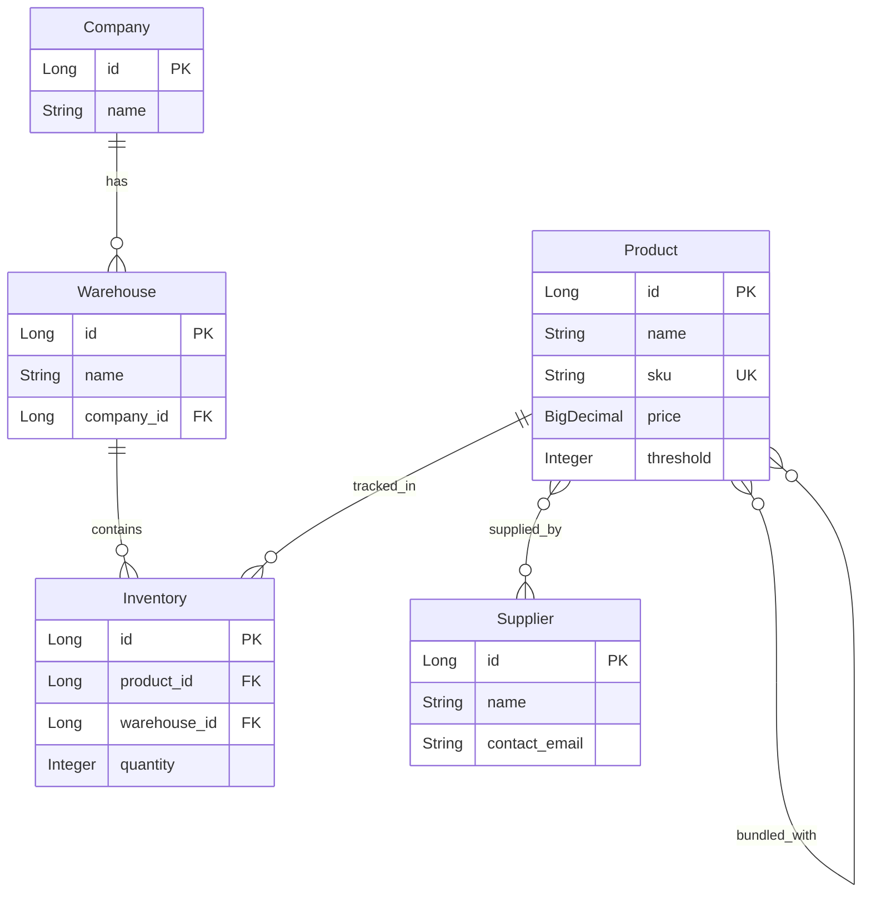

# StockFlow - Inventory Management Platform Backend

## 📋 Case Study Overview

StockFlow is a comprehensive inventory management platform designed to help businesses efficiently track products, manage warehouses, monitor stock levels, and receive intelligent alerts for low-stock situations. This backend application provides RESTful APIs for product creation and low-stock monitoring with multi-tenant company support.

## 🎯 Business Requirements

### Core Functionality
- **Product Management**: Create and manage products with unique SKUs, pricing, and threshold settings
- **Multi-Tenant Architecture**: Support multiple companies with their own warehouses
- **Inventory Tracking**: Real-time stock level monitoring across multiple warehouses
- **Smart Alerts**: Automated low-stock alerts with supplier information and stockout predictions
- **Supplier Management**: Track supplier relationships and contact information

### Technical Requirements
- Java 17+ with Spring Boot 3.x
- Spring Data JPA for database operations
- H2 database for development, PostgreSQL for production
- RESTful API design with proper HTTP status codes
- Comprehensive validation and error handling
- Clean architecture with proper separation of concerns

## 🏗️ Architecture & Design

### Project Structure
```
src/
├── main/
│   ├── java/com/stockflow/
│   │   ├── StockFlowApplication.java          # Main Spring Boot application
│   │   ├── entity/                            # JPA entities
│   │   │   ├── Product.java                   # Product with bundles
│   │   │   ├── Company.java                   # Multi-tenant companies
│   │   │   ├── Warehouse.java                 # Company warehouses
│   │   │   ├── Inventory.java                 # Stock tracking
│   │   │   └── Supplier.java                  # Supplier management
│   │   ├── dto/                               # Data Transfer Objects
│   │   │   ├── ProductRequestDto.java         # Product creation request
│   │   │   ├── LowStockAlertDto.java          # Alert response
│   │   │   └── SupplierDto.java               # Supplier information
│   │   ├── repository/                        # Data access layer
│   │   │   ├── ProductRepository.java
│   │   │   ├── CompanyRepository.java
│   │   │   ├── WarehouseRepository.java
│   │   │   ├── InventoryRepository.java
│   │   │   └── SupplierRepository.java
│   │   ├── service/                           # Business logic layer
│   │   │   ├── ProductService.java            # Product operations
│   │   │   └── AlertService.java              # Alert generation
│   │   ├── controller/                        # REST API endpoints
│   │   │   ├── ProductController.java         # Product APIs
│   │   │   └── AlertController.java           # Alert APIs
│   │   └── config/                            # Configuration
│   │       └── DataInitializer.java           # Sample data setup
│   └── resources/
│       └── application.yml                    # Application configuration
└── test/                                      # Test files (to be implemented)
```

## 🚀 Getting Started

### Prerequisites
- Java 17 or higher
- Maven 3.6 or higher
- Git
- IDE (IntelliJ IDEA, Eclipse, or VS Code)

### Installation & Setup

1. **Clone the Repository**
   ```bash
   git clone https://github.com/Abhishek-Atole/bynry-backend-case-study
   cd bynry-backend-case-study
   ```

2. **Build the Project**
   ```bash
   mvn clean compile
   ```

3. **Run the Application**
   ```bash
   mvn spring-boot:run
   ```

4. **Access H2 Console** (Development)
   - URL: http://localhost:8080/h2-console
   - JDBC URL: `jdbc:h2:mem:stockflow`
   - Username: `sa`
   - Password: `password`

## 📚 API Documentation

### Base URL
```
http://localhost:8080/api
```

### 1. Product Creation API

**Endpoint**: `POST /api/products`

**Description**: Creates a new product and initializes inventory in the specified warehouse.

**Request Body**:
```json
{
  "name": "Wireless Bluetooth Headphones",
  "sku": "WBH-001",
  "price": 99.99,
  "warehouseId": 1,
  "initialQuantity": 50
}
```

**Validation Rules**:
- `name`: Required, cannot be blank
- `sku`: Required, must be unique across all products
- `price`: Required, must be greater than 0
- `warehouseId`: Required, must reference existing warehouse
- `initialQuantity`: Required, cannot be negative

**Success Response** (200 OK):
```json
{
  "message": "Product created successfully",
  "product_id": 123
}
```

**Error Response** (400 Bad Request):
```json
{
  "message": "SKU already exists: WBH-001",
  "product_id": null
}
```

**Example cURL**:
```bash
curl -X POST http://localhost:8080/api/products \
  -H "Content-Type: application/json" \
  -d '{
    "name": "Gaming Laptop",
    "sku": "LAPTOP-GAMING-001",
    "price": 1299.99,
    "warehouseId": 1,
    "initialQuantity": 25
  }'
```

### 2. Low-Stock Alerts API

**Endpoint**: `GET /api/companies/{companyId}/alerts/low-stock`

**Description**: Retrieves all low-stock alerts for a specific company across all its warehouses.

**Path Parameters**:
- `companyId`: ID of the company to check for alerts

**Success Response** (200 OK):
```json
[
  {
    "productId": 1,
    "productName": "Laptop Computer",
    "sku": "LAPTOP-001",
    "warehouseId": 1,
    "warehouseName": "Main Warehouse",
    "currentStock": 5,
    "threshold": 15,
    "daysUntilStockout": 5,
    "supplier": {
      "id": 1,
      "name": "Global Suppliers Inc",
      "contactEmail": "contact@globalsuppliers.com"
    }
  },
  {
    "productId": 2,
    "productName": "Wireless Mouse",
    "sku": "MOUSE-001",
    "warehouseId": 2,
    "warehouseName": "Secondary Warehouse",
    "currentStock": 25,
    "threshold": 50,
    "daysUntilStockout": 25,
    "supplier": {
      "id": 1,
      "name": "Global Suppliers Inc",
      "contactEmail": "contact@globalsuppliers.com"
    }
  }
]
```

**Example cURL**:
```bash
curl http://localhost:8080/api/companies/1/alerts/low-stock
```

## 🗄️ Database Schema

### Entity Relationships



### Key Features

- **Multi-Tenant Design**: Companies have isolated warehouses and inventory
- **Product Bundles**: Self-referencing many-to-many relationship for product bundling
- **Supplier Management**: Many-to-many relationship between products and suppliers
- **Stock Thresholds**: Configurable low-stock thresholds per product
- **Inventory Tracking**: Junction table linking products to specific warehouses

## 🛠️ Configuration

### Development Environment (H2)
```yaml
spring:
  profiles:
    active: dev
  datasource:
    url: jdbc:h2:mem:stockflow
    driver-class-name: org.h2.Driver
    username: sa
    password: password
  h2:
    console:
      enabled: true
  jpa:
    hibernate:
      ddl-auto: create-drop
    show-sql: true
```

### Production Environment (PostgreSQL)
```yaml
spring:
  profiles:
    active: prod
  datasource:
    url: jdbc:postgresql://localhost:5432/stockflow
    driver-class-name: org.postgresql.Driver
    username: ${DB_USERNAME:stockflow}
    password: ${DB_PASSWORD:password}
  jpa:
    hibernate:
      ddl-auto: validate
```

### Environment Variables (Production)
- `DB_USERNAME`: PostgreSQL database username
- `DB_PASSWORD`: PostgreSQL database password

## 📊 Sample Data

The application automatically loads sample data in development mode:

### Companies
- **TechCorp**: Sample technology company

### Warehouses
- **Main Warehouse**: Primary storage facility
- **Secondary Warehouse**: Additional storage location

### Products (with Low Stock)
- **Laptop Computer** (SKU: LAPTOP-001): 5 units (threshold: 15) - **LOW STOCK**
- **Wireless Mouse** (SKU: MOUSE-001): 25 units (threshold: 50) - **LOW STOCK**

### Suppliers
- **Global Suppliers Inc**: Primary supplier for all products

## 🔒 Code of Conduct

### Development Standards

#### 1. Code Quality
- **Clean Code**: Follow clean code principles with meaningful variable and method names
- **SOLID Principles**: Adhere to Single Responsibility, Open/Closed, Liskov Substitution, Interface Segregation, and Dependency Inversion principles
- **DRY Principle**: Don't Repeat Yourself - avoid code duplication
- **Documentation**: Include Javadoc for all public methods and classes

#### 2. Spring Boot Best Practices
- **Layered Architecture**: Maintain clear separation between Controller, Service, and Repository layers
- **DTO Pattern**: Use Data Transfer Objects for API contracts, never expose entities directly
- **Validation**: Implement comprehensive validation using Bean Validation annotations
- **Transaction Management**: Use `@Transactional` for operations requiring data consistency
- **Exception Handling**: Implement proper exception handling with meaningful error messages

#### 3. Database Design
- **Normalization**: Follow database normalization principles to reduce data redundancy
- **Indexing**: Use appropriate indexes for frequently queried fields (SKU, company relationships)
- **Constraints**: Implement database constraints for data integrity
- **Naming Conventions**: Use consistent naming conventions for tables and columns

#### 4. API Design
- **RESTful Principles**: Follow REST conventions for URL patterns and HTTP methods
- **HTTP Status Codes**: Use appropriate HTTP status codes for different scenarios
- **Consistent Response Format**: Maintain consistent JSON response structures
- **Versioning**: Plan for API versioning using URL paths or headers

#### 5. Security Considerations
- **Input Validation**: Validate all input data to prevent injection attacks
- **Error Handling**: Don't expose sensitive information in error messages
- **Authentication**: Implement proper authentication (to be added in future versions)
- **Authorization**: Add role-based access control (planned for future releases)

### Contribution Guidelines

#### Git Workflow
1. **Feature Branches**: Create feature branches from `main` for new features
2. **Commit Messages**: Use conventional commit messages (feat:, fix:, docs:, etc.)
3. **Pull Requests**: Submit pull requests for code review before merging
4. **Code Review**: All code must be reviewed by at least one other developer

#### Testing Standards
- **Unit Tests**: Write unit tests for all service methods
- **Integration Tests**: Include integration tests for API endpoints
- **Test Coverage**: Maintain minimum 80% code coverage
- **Test Naming**: Use descriptive test method names explaining the scenario and expected outcome

#### Performance Guidelines
- **Database Queries**: Optimize database queries to avoid N+1 problems
- **Caching**: Implement caching for frequently accessed data
- **Pagination**: Use pagination for endpoints returning large datasets
- **Monitoring**: Include logging for performance monitoring

## 🚦 Business Logic & Rules

### Product Creation Rules
1. **SKU Uniqueness**: Each product must have a unique SKU across the entire system
2. **Warehouse Validation**: Products can only be created in existing warehouses
3. **Atomic Operations**: Product and initial inventory creation must be atomic
4. **Price Validation**: Product prices must be positive values
5. **Initial Stock**: Initial inventory quantity cannot be negative

### Low-Stock Alert Rules
1. **Threshold-Based**: Alerts triggered when current stock < product threshold
2. **Company Scope**: Alerts are generated per company, not globally
3. **Stockout Prediction**: Days until stockout calculated using average daily sales
4. **Supplier Information**: Include primary supplier contact for procurement
5. **Real-Time Calculation**: Alerts calculated dynamically on request

### Inventory Management Rules
1. **Multi-Warehouse**: Products can exist in multiple warehouses with different quantities
2. **Warehouse Isolation**: Inventory is tracked separately per warehouse
3. **Quantity Tracking**: All inventory movements must maintain accurate quantities
4. **Threshold Monitoring**: Each product has configurable low-stock thresholds

## 🔧 Technical Specifications

### Dependencies
```xml
<!-- Core Spring Boot -->
<dependency>
    <groupId>org.springframework.boot</groupId>
    <artifactId>spring-boot-starter-web</artifactId>
</dependency>
<dependency>
    <groupId>org.springframework.boot</groupId>
    <artifactId>spring-boot-starter-data-jpa</artifactId>
</dependency>
<dependency>
    <groupId>org.springframework.boot</groupId>
    <artifactId>spring-boot-starter-validation</artifactId>
</dependency>

<!-- Database -->
<dependency>
    <groupId>com.h2database</groupId>
    <artifactId>h2</artifactId>
</dependency>
<dependency>
    <groupId>org.postgresql</groupId>
    <artifactId>postgresql</artifactId>
</dependency>

<!-- Utilities -->
<dependency>
    <groupId>org.projectlombok</groupId>
    <artifactId>lombok</artifactId>
</dependency>
```

### Key Annotations Used
- `@SpringBootApplication`: Main application configuration
- `@Entity`, `@Table`: JPA entity mapping
- `@OneToMany`, `@ManyToOne`, `@ManyToMany`: Relationship mapping
- `@RestController`, `@RequestMapping`: REST API controllers
- `@Service`, `@Repository`: Service and data access layers
- `@Transactional`: Transaction management
- `@Valid`, `@NotNull`, `@NotBlank`: Validation
- `@Data`, `@NoArgsConstructor`, `@AllArgsConstructor`: Lombok annotations

## 🧪 Testing

### Test Coverage Areas
1. **Unit Tests**
   - Service layer business logic
   - Repository custom queries
   - DTO validation rules
   - Entity relationships

2. **Integration Tests**
   - API endpoint functionality
   - Database operations
   - Transaction rollbacks
   - Error handling scenarios

3. **Test Data**
   - Use `@DataJpaTest` for repository tests
   - Mock external dependencies in unit tests
   - Create test fixtures for consistent test data

### Running Tests
```bash
# Run all tests
mvn test

# Run specific test class
mvn test -Dtest=ProductServiceTest

# Run tests with coverage
mvn test jacoco:report
```

## 🚀 Deployment

### Development Deployment
```bash
# Start application with dev profile
mvn spring-boot:run -Dspring-boot.run.profiles=dev
```

### Production Deployment
1. **Database Setup**
   ```sql
   CREATE DATABASE stockflow;
   CREATE USER stockflow_user WITH PASSWORD 'secure_password';
   GRANT ALL PRIVILEGES ON DATABASE stockflow TO stockflow_user;
   ```

2. **Environment Configuration**
   ```bash
   export DB_USERNAME=stockflow_user
   export DB_PASSWORD=secure_password
   export SPRING_PROFILES_ACTIVE=prod
   ```

3. **Application Startup**
   ```bash
   java -jar target/stockflow-backend-1.0.0.jar
   ```

## 📈 Future Enhancements

### Planned Features
1. **Authentication & Authorization**
   - JWT-based authentication
   - Role-based access control (Admin, Manager, Viewer)
   - API key management for third-party integrations

2. **Advanced Inventory Features**
   - Inventory movements tracking (IN/OUT transactions)
   - Batch/lot number tracking for product traceability
   - Expiration date management for perishable products
   - Automated reorder points and purchase order generation

3. **Reporting & Analytics**
   - Stock movement reports
   - Sales forecasting for better stock predictions
   - Supplier performance analytics
   - Dashboard with real-time metrics

4. **Notifications**
   - Email alerts for low-stock situations
   - SMS notifications for critical stock levels
   - Webhook integrations for external systems

5. **API Enhancements**
   - Bulk product import/export (CSV, Excel)
   - Advanced filtering and search capabilities
   - Pagination and sorting for large datasets
   - GraphQL API for flexible data fetching

## 🤝 Contributing

### How to Contribute
1. **Fork the Repository**: Create your own fork of the project
2. **Create Feature Branch**: `git checkout -b feature/amazing-feature`
3. **Make Changes**: Implement your feature following coding standards
4. **Add Tests**: Include comprehensive tests for new functionality
5. **Commit Changes**: `git commit -m 'feat: add amazing feature'`
6. **Push to Branch**: `git push origin feature/amazing-feature`
7. **Create Pull Request**: Submit PR with detailed description

### Code Review Process
- All submissions require review from project maintainers
- Automated tests must pass before merge
- Code coverage should not decrease
- Documentation must be updated for new features

## 📞 Support

### Getting Help
- **Issues**: Create GitHub issues for bugs or feature requests
- **Discussions**: Use GitHub discussions for general questions
- **Documentation**: Check this README and inline code documentation

### Reporting Bugs
When reporting bugs, please include:
- Java version and OS
- Steps to reproduce the issue
- Expected vs actual behavior
- Relevant log outputs
- Database state (if applicable)

## 📄 License

This project is licensed under the MIT License - see the LICENSE file for details.

## 🙏 Acknowledgments

- Spring Boot team for excellent framework and documentation
- H2 Database for seamless development experience
- Lombok project for reducing boilerplate code
- Maven for dependency management and build lifecycle

---

**StockFlow Backend** - Built with ❤️ using Spring Boot 3 and Java.
